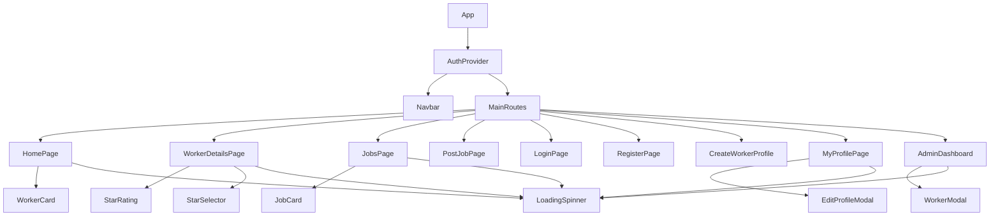
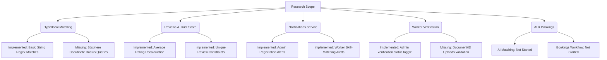

# Technical Architecture & System Documentation
## Project: Local Worker Connector (SkillBridge)
**MERN Stack Platform for Hyperlocal Daily Wage Worker Connection**

---

## SECTION 1 – PROJECT OVERVIEW

### 1. Project Name
* **Codebase Identifier:** Local Worker Connector
* **User-Facing Product Name:** SkillBridge (as defined in the header/logo configuration of the client application)

### 2. Purpose
SkillBridge is a full-stack MERN (MongoDB, Express, React, Node.js) platform built to bridge the gap between daily wage workers (e.g., plumbers, electricians, painters, carpenters, cooks) and local clients (homeowners, contractors, or businesses). The application provides:
* A way for daily wage workers or their families/representatives to register their skills, location, and contact information.
* A direct-dial connection mechanism that eliminates intermediary commission agents, allowing workers to keep 100% of their earnings.
* A public bulletin board where clients can post immediate requirements (e.g., urgent pipe repairs, wiring tasks) without mandatory friction barriers.

### 3. Problem Statement
Daily wage workers in informal sectors face high underemployment due to localized visibility barriers and lack of marketing channels. Conversely, homeowners face friction finding nearby, verified, and rated professionals for quick tasks. Existing commercial platforms charge heavy commission fees, require complex registrations, and mandate digital transactions, which creates barriers for low-literacy or underbanked workers.

SkillBridge addresses this by:
1. **Low Friction Posting:** Allowing households to post jobs without forcing account registration.
2. **Direct Interaction:** Facilitating direct telephone connection (`tel:` links) instead of forcing inside-app chats or payments.
3. **Assisted/Proxy Registration:** Allowing workers to register themselves, or be registered by family members or administrators.
4. **Admin Verification Flow:** Ensuring safety and trust via an explicit admin verification badge system.

### 4. Current Project Status
The codebase is a **nearly complete MVP (Minimum Viable Product)**. The backend Express API server is fully functional and includes database model schemas, file upload configurations, authentication hooks, and role checks. The frontend client app is a single-page React app built using Vite, Tailwind CSS, and Framer Motion, with dynamic route definitions, global state providers, context management, forms validation, and toast notifications.

### 5. Current Features
* **Hyperlocal Search & Filtering:** Filter workers by skill (Plumber, Electrician, Painter, etc.) and search by location string on the home page.
* **Worker Profile Creation & Editing:** Workers (or their family members) can register an account with the role `employee` and create/edit a worker profile (name, skill, phone, location, experience, photo upload).
* **Admin Dashboard:** Pre-seeded admin user can view stats, search workers, toggle verification status (`isVerified`), edit profiles, delete profiles, view reviews list, and delete reviews.
* **Job Board:** Public list of jobs with title, description, skill badge, location, working hours, and contact details.
* **Job Posting with Image:** Clients can submit job posts, including dragging/uploading images.
* **Notification System:**
  * When an `employee` registers a worker profile, it defaults to `isVerified: false` and notifies all administrators of a pending verification request.
  * When a job is posted under a skill category, all workers registered under that skill category are automatically sent a notification in their dashboard header.
* **Reviews & Ratings:** Logged-in users can post star ratings (1 to 5 stars) and feedback comments on worker details pages. The system automatically recalculates the worker's average rating on review creation or deletion.

### 6. Missing Features
* **Geolocation-Based Querying:** Hyperlocal searches currently rely on text substrings (e.g., "Mumbai") rather than coordinate distances (MongoDB 2dsphere indexes).
* **Security Checks on Job Post Modifications:** Standard users can modify or delete any job via API endpoints (`PUT /api/jobs/:id`, `DELETE /api/jobs/:id`) due to a lack of ownership checks in the controller.
* **Worker Registration Ownership Lock:** A user can register multiple workers, but there is no mechanism locking a single worker profile to a unique user login.
* **OTP Mobile Validation:** The system allows any phone number structure, meaning dummy/non-existent numbers can be registered.

### 7. Existing Limitations
* **Local Storage Files:** Uploaded photos are stored on the local disk inside the Express server's `uploads/` folder. This will cause file loss if deployed on ephemeral cloud services (like Heroku or render.com without persistent volumes) and will fail to scale horizontally.
* **Basic Search:** The search relies on database regex matches (`$regex`), which does not support fuzzy spelling checks or autocomplete indexing.
* **No Client-Worker Contract Binding:** There is no in-app contract state (e.g., "Booked", "Completed", "Paid"), meaning the platform cannot track matching statistics or success rates automatically.

### 8. Future Scope
* **Transition to AWS S3 / Cloudinary:** Store worker photos and job images on a cloud CDN instead of the local server filesystem.
* **Real-time Map Integration:** Render nearby workers on a map using Leaflet.js or Mapbox APIs.
* **Multi-lingual Interface:** Support localization in regional languages to help workers who do not speak English.
* **SMS Gateway Integration:** Integrate Twilio or similar services to send OTP SMS confirmations during registration.

---

## SECTION 2 – COMPLETE FOLDER STRUCTURE

### Visual Directory Tree
```
Local Worker Connector/
├── .git/                        # Git history and metadata (Used)
├── .gitignore                   # Declares untracked files to ignore (Used)
├── README.md                    # Quick start documentation (Used)
├── WORKFLOW.md                  # Workflow session summary (Used)
├── client/                      # React Frontend Root Directory (Used)
│   ├── dist/                    # Compiled production build artifacts (Used during deploy)
│   ├── node_modules/            # Frontend npm dependencies (Used)
│   ├── package-lock.json        # Frontend dependency lockfile (Used)
│   ├── package.json             # Frontend dependency config & scripts (Used)
│   ├── postcss.config.js        # PostCSS configuration for Tailwind CSS (Used)
│   ├── tailwind.config.js       # Tailwind theme colors and utilities (Used)
│   ├── vite.config.js           # Vite server settings and backend route proxies (Used)
│   ├── index.html               # Main HTML wrapper & entry page (Used)
│   └── src/                     # React application source code (Used)
│       ├── main.jsx             # React entry point, imports App, Router, Toaster (Used)
│       ├── App.jsx              # App component defining routes & auth providers (Used)
│       ├── index.css            # Custom utility definitions & Tailwind imports (Used)
│       ├── api/                 # Axios HTTP client interface layer (Used)
│       │   ├── auth.js          # Authentication endpoint functions (Used)
│       │   ├── axios.js         # Axios client setup, JWT interceptors, 401 redirect (Used)
│       │   ├── jobs.js          # Job board CRUD endpoint functions (Used)
│       │   ├── notifications.js # Notifications read/write endpoint functions (Used)
│       │   ├── reviews.js       # Worker reviews and ratings API calls (Used)
│       │   └── workers.js       # Worker CRUD & verification API calls (Used)
│       ├── components/          # Reusable react components (Used)
│       │   ├── JobCard.jsx      # Individual job listing display card (Used)
│       │   ├── LoadingSpinner.jsx # Adaptive loading animation indicator (Used)
│       │   ├── Navbar.jsx       # Header navigation bar with notifications and auth (Used)
│       │   ├── ProtectedRoute.jsx # Wrapper component to guard private routes (Used)
│       │   └── WorkerCard.jsx   # Individual worker search display card (Used)
│       ├── context/             # React global context providers (Used)
│       │   └── AuthContext.jsx  # Global state provider for user logs and token storage (Used)
│       └── pages/               # React router page endpoints (Used)
│           ├── AdminDashboard.jsx # Stats, worker verification, and reviews list (Used)
│           ├── CreateWorkerProfile.jsx # Employee form to set up their worker details (Used)
│           ├── HomePage.jsx     # Landing hero, search bar, category pills, and worker grid (Used)
│           ├── JobsPage.jsx     # Active job board lists with filtering (Used)
│           ├── LoginPage.jsx    # Login form with show/hide password (Used)
│           ├── MyProfilePage.jsx # Worker dashboard, availability toggle, and edit modal (Used)
│           ├── PostJobPage.jsx  # Job posting form with drag-and-drop image upload (Used)
│           ├── RegisterPage.jsx # Registration form with client/employee role cards (Used)
│           └── WorkerDetailsPage.jsx # Worker profile view, contact CTA, and ratings form (Used)
└── server/                      # Node/Express Backend Root Directory (Used)
    ├── .env                     # Configuration variables (Used)
    ├── .env.example             # Environment configuration template (Used)
    ├── package-lock.json        # Backend dependency lockfile (Used)
    ├── package.json             # Backend script scripts & dependency configuration (Used)
    ├── seed.js                  # Database seeder for admin and sample workers (Used)
    ├── server.js                # Express app configuration & server starter (Used)
    ├── controllers/             # Backend endpoints controller functions (Used)
    │   ├── authController.js    # Register, login, and getMe endpoints logic (Used)
    │   ├── jobController.js     # Job board creation, reads, edits, deletes (Used)
    │   ├── notificationController.js # User notifications retrieve and read toggle (Used)
    │   ├── reviewController.js  # Review creation, worker average recalculation (Used)
    │   └── workerController.js  # Worker profile CRUD and admin verification (Used)
    ├── middleware/              # Express endpoint pipeline request interceptors (Used)
    │   ├── adminMiddleware.js   # Verifies request user's role is 'admin' (Used)
    │   ├── authMiddleware.js    # Verifies JWT and loads user context (Used)
    │   └── errorHandler.js      # Formats syntax, duplicate key, validation errors (Used)
    ├── models/                  # Mongoose MongoDB Schemas (Used)
    │   ├── Job.js               # Job listing model schema details (Used)
    │   ├── Notification.js      # User dashboard notification model schema details (Used)
    │   ├── Review.js            # Worker reviews and ratings model schema details (Used)
    │   ├── User.js              # Credentials and roles model schema details (Used)
    │   └── Worker.js            # Workers metadata, skills, verification state (Used)
    ├── routes/                  # Express routes definitions mapping endpoints to controller (Used)
    │   ├── authRoutes.js        # Auth routing definitions (Used)
    │   ├── jobRoutes.js         # Jobs routing definitions (Used)
    │   ├── notificationRoutes.js # Notifications routing definitions (Used)
    │   ├── reviewRoutes.js      # Reviews routing definitions (Used)
    │   └── workerRoutes.js      # Workers routing definitions (Used)
    ├── uploads/                 # Server filesystem directory for image uploads (Used)
    └── utils/                   # Backend helper scripts (Used)
        └── generateToken.js     # Helper function to sign 7-day JWT tokens (Used)
```

---

## SECTION 3 – FRONTEND DOCUMENTATION

### Page-by-Page Analysis

| Page Name | Purpose | Route | Components Used | API Calls | State Management | Hooks Used | Libraries Used | UI Status |
|---|---|---|---|---|---|---|---|---|
| **HomePage** | Search, filter, and discover verified workers. | `/` | [Navbar](file:///s:/PROJECT/Local%20Worker%20Connector/client/src/components/Navbar.jsx), [WorkerCard](file:///s:/PROJECT/Local%20Worker%20Connector/client/src/components/WorkerCard.jsx), [LoadingSpinner](file:///s:/PROJECT/Local%20Worker%20Connector/client/src/components/LoadingSpinner.jsx) | `getWorkers(params)` | `workers`, `loading`, `skillFilter`, `locationInput`, `appliedLocation` | `useState`, `useEffect`, `useCallback`, `useRef`, `useNavigate`, `useInView` | `framer-motion`, `react-icons`, `react-hot-toast` | Premium; incorporates dark gradients, counts stats with animation, and fades cards. |
| **WorkerDetailsPage** | View detailed worker information, dial contacts, view rating stats, and submit reviews. | `/workers/:id` | [Navbar](file:///s:/PROJECT/Local%20Worker%20Connector/client/src/components/Navbar.jsx), [LoadingSpinner](file:///s:/PROJECT/Local%20Worker%20Connector/client/src/components/LoadingSpinner.jsx), `StarRating`, `StarSelector` | `getWorkerById(id)`, `getWorkerReviews(id)`, `addReview(data)` | `worker`, `reviews`, `loading`, `commentInput`, `ratingInput`, `submittingReview` | `useState`, `useEffect`, `useCallback`, `useParams`, `useNavigate`, `useAuth` | `react-icons`, `react-hot-toast` | Clean; details split by cards, contains reviews table, and checks verification status. |
| **JobsPage** | Discover local tasks posted by clients. | `/jobs` | [Navbar](file:///s:/PROJECT/Local%20Worker%20Connector/client/src/components/Navbar.jsx), [JobCard](file:///s:/PROJECT/Local%20Worker%20Connector/client/src/components/JobCard.jsx), [LoadingSpinner](file:///s:/PROJECT/Local%20Worker%20Connector/client/src/components/LoadingSpinner.jsx) | `getJobs()` | `jobs`, `loading`, `skillFilter`, `searchQuery` | `useState`, `useEffect`, `useAuth` | `react-icons`, `react-hot-toast` | Solid; dark hero block, filter pills, and search autocomplete overlay. |
| **PostJobPage** | Submit job posts (open to all, optional login). | `/post-job` | [Navbar](file:///s:/PROJECT/Local%20Worker%20Connector/client/src/components/Navbar.jsx) | `createJob(formData)` | `loading`, `success`, `imagePreview` | `useState`, `useNavigate`, `useForm` | `react-hook-form`, `react-icons`, `react-hot-toast` | High quality; forms inputs validated, image preview wrapper, redirects via progress bar. |
| **LoginPage** | Login via phone/password. | `/login` | [Navbar](file:///s:/PROJECT/Local%20Worker%20Connector/client/src/components/Navbar.jsx) | `login(data)` | `loading`, `showPwd` | `useState`, `useNavigate`, `useForm`, `useAuth` | `react-hook-form`, `react-icons`, `react-hot-toast` | Standard clean card layout with validation errors. |
| **RegisterPage** | Sign up with User or Employee role selection cards. | `/register` | [Navbar](file:///s:/PROJECT/Local%20Worker%20Connector/client/src/components/Navbar.jsx) | `registerUser(payload)` | `loading`, `showPwd` | `useState`, `useNavigate`, `useForm`, `useAuth` | `react-hook-form`, `react-icons`, `react-hot-toast` | Very good; includes interactive role selection cards and password matches validation. |
| **CreateWorkerProfile** | Form for employees to create their public worker profile. | `/create-profile` | [Navbar](file:///s:/PROJECT/Local%20Worker%20Connector/client/src/components/Navbar.jsx) | `createWorker(formData)` | `loading`, `previewUrl` | `useState`, `useNavigate`, `useForm` | `react-hook-form`, `react-icons`, `react-hot-toast` | Clean form layouts with visual validation indicators. |
| **MyProfilePage** | View/update worker profile details and toggle availability. | `/my-profile` | [Navbar](file:///s:/PROJECT/Local%20Worker%20Connector/client/src/components/Navbar.jsx), [LoadingSpinner](file:///s:/PROJECT/Local%20Worker%20Connector/client/src/components/LoadingSpinner.jsx), `EditProfileModal` | `getMyProfile()`, `updateWorker(id, formData)` | `worker`, `loading`, `isEditing`, `previewUrl`, `modalLoading` | `useState`, `useEffect`, `useForm` | `react-hook-form`, `react-icons`, `react-hot-toast` | Premium; features a banner layout and warning indicators for pending verification status. |
| **AdminDashboard** | Portal for admins to manage profiles, verify workers, and delete reviews. | `/admin` | [Navbar](file:///s:/PROJECT/Local%20Worker%20Connector/client/src/components/Navbar.jsx), [LoadingSpinner](file:///s:/PROJECT/Local%20Worker%20Connector/client/src/components/LoadingSpinner.jsx), `WorkerModal` | `getWorkers({all:true})`, `createWorker()`, `updateWorker()`, `deleteWorker()`, `toggleVerification()`, `getAllReviews()`, `deleteReviewApi()` | `workers`, `reviews`, `loading`, `loadingReviews`, `modal`, `search`, `verifyingId`, `activeTab` | `useState`, `useEffect`, `useCallback`, `useForm` | `react-hook-form`, `react-icons`, `react-hot-toast` | Functional; includes dynamic stats cards, clean tables, tab selections, and a management modal. |

### Reusable Components

1. **[Navbar](file:///s:/PROJECT/Local%20Worker%20Connector/client/src/components/Navbar.jsx):**
   * Purpose: Sticky top navigation, user profile identity widget, mobile-responsive sidebar menu, and notification center dropdown showing unread notification count with a "Mark read" action.
2. **[WorkerCard](file:///s:/PROJECT/Local%20Worker%20Connector/client/src/components/WorkerCard.jsx):**
   * Purpose: Standard summary card for workers, displaying: avatar placeholder, rating stars, location, skill badge, verification check, availability indicator dot, and direct telephone call trigger.
3. **[JobCard](file:///s:/PROJECT/Local%20Worker%20Connector/client/src/components/JobCard.jsx):**
   * Purpose: Standard summary card for job listings, showing title, time-ago, description snippet, skill category, payment-type badge (Cash, Food, Both), location, and direct call trigger to the employer.
4. **[LoadingSpinner](file:///s:/PROJECT/Local%20Worker%20Connector/client/src/components/LoadingSpinner.jsx):**
   * Purpose: Adaptable SVG spinner. Supports small/medium inline states and full-screen loading page overlays.
5. **[ProtectedRoute](file:///s:/PROJECT/Local%20Worker%20Connector/client/src/components/ProtectedRoute.jsx):**
   * Purpose: Wrapper component that redirects anonymous users to `/login` and blocks non-admin users from accessing admin routes.

### Component Hierarchy


---

## SECTION 4 – BACKEND DOCUMENTATION

### Server configuration
* **Server Entry Point:** [server.js](file:///s:/PROJECT/Local%20Worker%20Connector/server/server.js). It initializes the Express application, sets up middleware like CORS and JSON parsers, hosts public uploaded assets statically under `/uploads`, defines API routing mounts, handles undefined endpoints with a 404 handler, and starts listening on port 5000 once connected to MongoDB.
* **Core Middleware Pipeline:**
  1. `cors()` - Enables cross-origin requests.
  2. `express.json()` / `express.urlencoded()` - Parses JSON and url-encoded payloads.
  3. `static()` - Serves files in `server/uploads` statically at `/uploads`.
  4. Global Error Handler - Catches all internal errors, formatting validation issues (400) and duplicate keys (400) cleanly.

### API Reference Table

| Method | Route | Authentication | Request Payload | Response Payload (200/201) | Purpose | Files Involved | Calling Frontend Components |
|---|---|---|---|---|---|---|---|
| **POST** | `/api/auth/register` | Public | `{ name, phone, password, role }` | `{ _id, name, phone, role, token }` | Register a new user | `authRoutes`, `authController`, `User` | [RegisterPage](file:///s:/PROJECT/Local%20Worker%20Connector/client/src/pages/RegisterPage.jsx) |
| **POST** | `/api/auth/login` | Public | `{ phone, password }` | `{ _id, name, phone, role, token }` | Login and sign JWT token | `authRoutes`, `authController`, `User` | [LoginPage](file:///s:/PROJECT/Local%20Worker%20Connector/client/src/pages/LoginPage.jsx) |
| **GET** | `/api/auth/me` | Private | None (Bearer JWT Header) | `{ _id, name, phone, role }` | Verify current user token | `authRoutes`, `authController`, `authMiddleware` | [AuthContext](file:///s:/PROJECT/Local%20Worker%20Connector/client/src/context/AuthContext.jsx) |
| **GET** | `/api/workers` | Public | Query: `?skill=&location=&all=&isVerified=` | `[{ _id, name, skill, location, phone, rating, ... }]` | Fetch verified workers (Admins get all if `all=true`) | `workerRoutes`, `workerController` | [HomePage](file:///s:/PROJECT/Local%20Worker%20Connector/client/src/pages/HomePage.jsx), [AdminDashboard](file:///s:/PROJECT/Local%20Worker%20Connector/client/src/pages/AdminDashboard.jsx) |
| **GET** | `/api/workers/me` | Private | None (Bearer JWT Header) | `{ _id, name, skill, location, phone, experience, isAvailable, ... }` | Fetch current worker profile details | `workerRoutes`, `workerController` | [MyProfilePage](file:///s:/PROJECT/Local%20Worker%20Connector/client/src/pages/MyProfilePage.jsx) |
| **GET** | `/api/workers/:id` | Public | URL Param: `id` | `{ _id, name, skill, location, rating, ... }` | Fetch single worker profile details | `workerRoutes`, `workerController` | [WorkerDetailsPage](file:///s:/PROJECT/Local%20Worker%20Connector/client/src/pages/WorkerDetailsPage.jsx) |
| **POST** | `/api/workers` | Private (Admin/Employee only) | Multipart Form: text fields + optional file `photo` | `{ _id, name, skill, location, phone, isVerified, ... }` | Create a new worker profile. Toggles `isVerified` automatically if created by admin. If created by worker, isVerified is set to false and admins are notified. | `workerRoutes`, `workerController`, `multer` | [CreateWorkerProfile](file:///s:/PROJECT/Local%20Worker%20Connector/client/src/pages/CreateWorkerProfile.jsx), [AdminDashboard](file:///s:/PROJECT/Local%20Worker%20Connector/client/src/pages/AdminDashboard.jsx) |
| **PUT** | `/api/workers/:id` | Private (Admin or Profile Creator) | Multipart Form: text fields + optional file `photo` | `{ _id, name, skill, location, ... }` | Update worker profile details | `workerRoutes`, `workerController`, `multer` | [MyProfilePage](file:///s:/PROJECT/Local%20Worker%20Connector/client/src/pages/MyProfilePage.jsx), [AdminDashboard](file:///s:/PROJECT/Local%20Worker%20Connector/client/src/pages/AdminDashboard.jsx) |
| **PATCH** | `/api/workers/:id/verify` | Private (Admin Only) | None | `{ message, isVerified }` | Toggle profile verification badge | `workerRoutes`, `workerController`, `adminMiddleware` | [AdminDashboard](file:///s:/PROJECT/Local%20Worker%20Connector/client/src/pages/AdminDashboard.jsx) |
| **DELETE** | `/api/workers/:id` | Private (Admin Only) | None | `{ message: "Worker deleted successfully" }` | Delete worker profile | `workerRoutes`, `workerController`, `adminMiddleware` | [AdminDashboard](file:///s:/PROJECT/Local%20Worker%20Connector/client/src/pages/AdminDashboard.jsx) |
| **GET** | `/api/jobs` | Public | None | `[{ _id, title, description, skill, location, ... }]` | Fetch active jobs (newest first) | `jobRoutes`, `jobController` | [JobsPage](file:///s:/PROJECT/Local%20Worker%20Connector/client/src/pages/JobsPage.jsx) |
| **GET** | `/api/jobs/:id` | Public | URL Param: `id` | `{ _id, title, description, phone, ... }` | Fetch single job post | `jobRoutes`, `jobController` | None (Direct route matches) |
| **POST** | `/api/jobs` | Public (Optional JWT) | Multipart Form: text fields + optional file `image` | `{ _id, title, description, skill, ... }` | Post a job requirement. Notifies registered workers with matching skills. | `jobRoutes`, `jobController`, `multer` | [PostJobPage](file:///s:/PROJECT/Local%20Worker%20Connector/client/src/pages/PostJobPage.jsx) |
| **PUT** | `/api/jobs/:id` | Private (Auth User) | Multipart Form: text fields + optional file `image` | `{ _id, title, description, ... }` | Update job post (Vulnerability: lacks ownership verification) | `jobRoutes`, `jobController` | None |
| **DELETE** | `/api/jobs/:id` | Private (Auth User) | None | `{ message: "Job deleted successfully" }` | Delete job post (Vulnerability: lacks ownership verification) | `jobRoutes`, `jobController` | None |
| **GET** | `/api/notifications/my` | Private | None | `[{ _id, message, type, isRead, data, user, ... }]` | Fetch notifications for logged-in user | `notificationRoutes`, `notificationController` | [Navbar](file:///s:/PROJECT/Local%20Worker%20Connector/client/src/components/Navbar.jsx) |
| **PATCH** | `/api/notifications/:id/read` | Private | URL Param: `id` | `{ _id, message, isRead, ... }` | Mark notification as read | `notificationRoutes`, `notificationController` | [Navbar](file:///s:/PROJECT/Local%20Worker%20Connector/client/src/components/Navbar.jsx) |
| **POST** | `/api/reviews` | Private (Users/Admins) | `{ workerId, rating, comment }` | `{ _id, workerId, userId: { name }, rating, comment }` | Post a worker review. Recalculates average rating. | `reviewRoutes`, `reviewController` | [WorkerDetailsPage](file:///s:/PROJECT/Local%20Worker%20Connector/client/src/pages/WorkerDetailsPage.jsx) |
| **GET** | `/api/reviews/worker/:workerId` | Public | URL Param: `workerId` | `[{ _id, comment, rating, userId: { name } }]` | Fetch reviews for a specific worker | `reviewRoutes`, `reviewController` | [WorkerDetailsPage](file:///s:/PROJECT/Local%20Worker%20Connector/client/src/pages/WorkerDetailsPage.jsx) |
| **GET** | `/api/reviews` | Private (Admin Only) | None | `[{ _id, comment, rating, userId: {name}, workerId: {name} }]` | Fetch all reviews | `reviewRoutes`, `reviewController`, `adminMiddleware` | [AdminDashboard](file:///s:/PROJECT/Local%20Worker%20Connector/client/src/pages/AdminDashboard.jsx) |
| **DELETE** | `/api/reviews/:id` | Private (Admin Only) | URL Param: `id` | `{ message: "Review deleted successfully" }` | Delete review. Recalculates average rating. | `reviewRoutes`, `reviewController`, `adminMiddleware` | [AdminDashboard](file:///s:/PROJECT/Local%20Worker%20Connector/client/src/pages/AdminDashboard.jsx) |

---

## SECTION 5 – DATABASE DOCUMENTATION

All collections run on MongoDB using Mongoose schemas.

### 1. `users` Collection
* **Purpose:** Stores credential and role information for clients, employees, and admins.
* **Mongoose Schema:**
```javascript
{
  name:      { type: String, required: true, trim: true },
  phone:     { type: String, required: true, unique: true, trim: true },
  password:  { type: String, required: true },
  role:      { type: String, enum: ['user', 'employee', 'admin'], default: 'user' }
} // timestamps: true
```
* **Relationships:** One-to-Many relationship with `workers` (via `createdBy`) and `jobs` (via `postedBy`).
* **Indexes:** `{ phone: 1 }` (unique).
* **Vulnerability & Improvements:** Add dynamic login attempt thresholds to prevent brute force attacks. Rename roles internally to improve access classification: standard clients as `client`, workers as `worker`, and platform operators as `admin`.

### 2. `workers` Collection
* **Purpose:** Stores profiles, availability states, ratings, and experience details of registered workers.
* **Mongoose Schema:**
```javascript
{
  name:        { type: String, required: true, trim: true },
  skill:       { type: String, required: true, trim: true },
  location:    { type: String, required: true, trim: true },
  phone:       { type: String, required: true, trim: true },
  isAvailable: { type: Boolean, default: true },
  isVerified:  { type: Boolean, default: false },
  rating:      { type: Number, default: 0, min: 0, max: 5 },
  photo:       { type: String, default: '' },
  experience:  { type: String, default: '' },
  createdBy:   { type: mongoose.Schema.Types.ObjectId, ref: 'User' }
} // timestamps: true
```
* **Relationships:** Linked to `users` (via `createdBy`) and references reviews in `reviews` (via `workerId`).
* **Indexes:** `{ createdBy: 1 }` to query profiles fast.
* **Vulnerability & Improvements:** Add a unique index on `createdBy` to prevent users from creating multiple profiles. Add a geolocation coordinate index (`2dsphere`) to support distance-based searches.

### 3. `jobs` Collection
* **Purpose:** Stores job postings submitted by users or guests.
* **Mongoose Schema:**
```javascript
{
  title:        { type: String, required: true, trim: true },
  description:  { type: String, required: true },
  skill:       { type: String, required: true, trim: true },
  location:     { type: String, required: true, trim: true },
  workingHours: { type: String, required: true },
  paymentType:  { type: String, enum: ['money', 'food', 'both'], required: true },
  imageUrl:     { type: String, default: '' },
  phone:        { type: String, required: true },
  postedBy:     { type: mongoose.Schema.Types.ObjectId, ref: 'User' }
} // timestamps: true
```
* **Relationships:** Links to `users` (via `postedBy`, optional).
* **Indexes:** `{ createdAt: -1 }` (default sorting index for active job lists).
* **Improvements:** Add `status` field (e.g. `['open', 'filled', 'expired']`) to manage listings.

### 4. `reviews` Collection
* **Purpose:** Stores worker ratings and feedback reviews.
* **Mongoose Schema:**
```javascript
{
  workerId: { type: mongoose.Schema.Types.ObjectId, ref: 'Worker', required: true },
  userId:   { type: mongoose.Schema.Types.ObjectId, ref: 'User', required: true },
  rating:   { type: Number, required: true, min: 1, max: 5 },
  comment:  { type: String, required: true, trim: true }
} // timestamps: true
```
* **Relationships:** Links to `workers` (via `workerId`) and `users` (via `userId`).
* **Indexes:** Unique index `{ workerId: 1, userId: 1 }` to prevent users from submitting multiple reviews for the same worker.
* **Improvements:** Add validation to prevent workers from submitting reviews on their own profiles.

### 5. `notifications` Collection
* **Purpose:** Stores user alerts (e.g., job alerts or registration approvals).
* **Mongoose Schema:**
```javascript
{
  message: { type: String, required: true },
  type:    { type: String, enum: ['worker_request', 'job_alert'], required: true },
  user:    { type: mongoose.Schema.Types.ObjectId, ref: 'User', required: true },
  isRead:  { type: Boolean, default: false },
  data:    { type: mongoose.Schema.Types.Mixed }
} // timestamps: true
```
* **Relationships:** Links to `users` (via `user`).
* **Indexes:** `{ user: 1, isRead: 1 }` to quickly query active unread counts.
* **Improvements:** Add TTL (Time-To-Live) index to automatically clear read notifications older than 30 days.

---

## SECTION 6 – AUTHENTICATION

### Authentication Flows

```
  Registration Flow:
  User Submit [Name, Phone, Password, Role] -> POST /api/auth/register
         ├── Backend: Validation checks, unique phone check
         ├── Schema Pre-save hook: Hash password using bcryptjs (10 rounds)
         └── Return JWT Token [ID, Role] + User details -> Saved to LocalStorage
         
  Login Flow:
  User Submit [Phone, Password] -> POST /api/auth/login
         ├── Backend: Retrieve User record by phone
         ├── User methods: bcryptjs.compare(enteredPassword, user.password)
         └── Return JWT Token + User details -> Saved to LocalStorage

  Authorization Flow (JWT Verification):
  API Call (Header: Authorization: Bearer <JWT>) -> Express Route
         ├── authMiddleware (protect):
         │     ├── Extract JWT token from header
         │     ├── jwt.verify(token, JWT_SECRET)
         │     └── Fetch User context from DB (excluding password) -> Set req.user
         └── Role Middleware:
               └── adminMiddleware (adminOnly): Verify req.user.role === 'admin'
```

### Role-Based Access Control

* **Admin Access (`role === 'admin'`):**
  * Toggles worker verification status (`PATCH /api/workers/:id/verify`).
  * Deletes worker profiles (`DELETE /api/workers/:id`).
  * Views all reviews (`GET /api/reviews`).
  * Deletes reviews (`DELETE /api/reviews/:id`).
* **Employee Access (`role === 'employee'`):**
  * Fetches own profile (`GET /api/workers/me`).
  * Creates own profile (`POST /api/workers`). Sets `isVerified = false` and triggers admin notification.
  * Updates own profile (`PUT /api/workers/:id`).
* **Client Access (`role === 'user'`):**
  * Can post jobs (`POST /api/jobs`). Sets `postedBy = user._id`.
  * Submits reviews on worker profiles (`POST /api/reviews`). Blocks workers from reviewing themselves.
* **Anonymous Access (Guests):**
  * Can browse workers (`GET /api/workers`) and view worker details.
  * Can browse job posts (`GET /api/jobs`).
  * Can post jobs (`POST /api/jobs`). Leaves `postedBy = undefined` and is treated as public.

### Authentication Codebase Locations

* **Backend Middleware:**
  * [authMiddleware.js](file:///s:/PROJECT/Local%20Worker%20Connector/server/middleware/authMiddleware.js) – Defines `protect` and `optionalProtect`.
  * [adminMiddleware.js](file:///s:/PROJECT/Local%20Worker%20Connector/server/middleware/adminMiddleware.js) – Defines `adminOnly` checking `req.user.role === 'admin'`.
* **Token Utilities:**
  * [generateToken.js](file:///s:/PROJECT/Local%20Worker%20Connector/server/utils/generateToken.js) – signs payload `{ id, role }` with 7-day expiration.
* **Frontend Authentication State:**
  * [AuthContext.jsx](file:///s:/PROJECT/Local%20Worker%20Connector/client/src/context/AuthContext.jsx) – Manages user profile variables, validates token on load (`GET /api/auth/me`), and handles login/logout memory cleanup.
  * [axios.js](file:///s:/PROJECT/Local%20Worker%20Connector/client/src/api/axios.js) – Axios interceptors. Automatically attaches `Authorization: Bearer <token>` to headers, and redirects users to `/login` if server returns `401 Unauthorized`.
  * [ProtectedRoute.jsx](file:///s:/PROJECT/Local%20Worker%20Connector/client/src/components/ProtectedRoute.jsx) – Router wrapper that guards frontend components.

---

## SECTION 7 – EXISTING FEATURES

### Feature Checklist

| Feature | Completed | Partially Completed | Not Started | Codebase Files | Details |
|---|:---:|:---:|:---:|---|---|
| **User Sign-up & Login** | ✅ | | | [authController.js](file:///s:/PROJECT/Local%20Worker%20Connector/server/controllers/authController.js), [User.js](file:///s:/PROJECT/Local%20Worker%20Connector/server/models/User.js), [AuthContext.jsx](file:///s:/PROJECT/Local%20Worker%20Connector/client/src/context/AuthContext.jsx), [LoginPage.jsx](file:///s:/PROJECT/Local%20Worker%20Connector/client/src/pages/LoginPage.jsx) | Handled using bcrypt password hashing and JWT token storage. Supports client vs. employee roles. |
| **Worker Profiles CRUD** | ✅ | | | [workerController.js](file:///s:/PROJECT/Local%20Worker%20Connector/server/controllers/workerController.js), [Worker.js](file:///s:/PROJECT/Local%20Worker%20Connector/server/models/Worker.js), [workerRoutes.js](file:///s:/PROJECT/Local%20Worker%20Connector/server/routes/workerRoutes.js) | Allows workers to create and update profiles. Admins have full access permissions. Supports image upload. |
| **Admin Verification Toggle** | ✅ | | | [workerController.js](file:///s:/PROJECT/Local%20Worker%20Connector/server/controllers/workerController.js), [AdminDashboard.jsx](file:///s:/PROJECT/Local%20Worker%20Connector/client/src/pages/AdminDashboard.jsx) | Allows admins to verify workers. Updates stats and toggles badges on verification. |
| **Public Jobs Board** | ✅ | | | [jobController.js](file:///s:/PROJECT/Local%20Worker%20Connector/server/controllers/jobController.js), [Job.js](file:///s:/PROJECT/Local%20Worker%20Connector/server/models/Job.js), [JobsPage.jsx](file:///s:/PROJECT/Local%20Worker%20Connector/client/src/pages/JobsPage.jsx), [PostJobPage.jsx](file:///s:/PROJECT/Local%20Worker%20Connector/client/src/pages/PostJobPage.jsx) | Lets anyone post jobs. Displays payment badges and includes filters. Supports image upload. |
| **Notifications Service** | ✅ | | | [notificationController.js](file:///s:/PROJECT/Local%20Worker%20Connector/server/controllers/notificationController.js), [Notification.js](file:///s:/PROJECT/Local%20Worker%20Connector/server/models/Notification.js) | Notifies admins on worker registrations, and notifies workers on matching job posts. |
| **Reviews & Ratings** | ✅ | | | [reviewController.js](file:///s:/PROJECT/Local%20Worker%20Connector/server/controllers/reviewController.js), [Review.js](file:///s:/PROJECT/Local%20Worker%20Connector/server/models/Review.js), [WorkerDetailsPage.jsx](file:///s:/PROJECT/Local%20Worker%20Connector/client/src/pages/WorkerDetailsPage.jsx) | Users can rate workers (1-5 stars). Updates average rating on workers. Blocks multiple reviews. |
| **Hyperlocal Matching** | | ✅ | | [workerController.js](file:///s:/PROJECT/Local%20Worker%20Connector/server/controllers/workerController.js#L13-L15) | Basic location text search using `$regex` string matching. Needs coordinates-based queries. |
| **AI Recommendations** | | | ❌ | None | Not implemented. Matches are strictly sorted by creation time. |
| **Verification Checks** | | ✅ | | [workerController.js](file:///s:/PROJECT/Local%20Worker%20Connector/server/controllers/workerController.js) | Basic admin toggle. Needs official document uploads (ID, certifications) for verification checks. |

---

## SECTION 8 – FRONTEND STATUS

### Page Audit

| Page Name | Completed % | Missing % | Pending UI/UX Improvements | UI Quality | Mobile Responsive | Accessibility Status |
|---|:---:|:---:|---|---|---|---|
| **HomePage** | 95% | 5% | Add geolocation autocomplete suggestions. | Premium (Tailwind, Framer Motion) | Fully Responsive | High; has alt descriptions on icons. |
| **WorkerDetailsPage** | 90% | 10% | Add review editing/deletion and upload portfolio files. | Good (Detailed sections) | Fully Responsive | Good; star buttons labelled. |
| **JobsPage** | 95% | 5% | Add sorting toggle options (Payment, Urgency). | Clean (Gradient Header) | Fully Responsive | Good; search input properly defined. |
| **PostJobPage** | 90% | 10% | Needs address validate fields. | Good (Upload drop zones) | Fully Responsive | High; input fields mapped to labels. |
| **LoginPage** | 100% | 0% | None. | Clean | Fully Responsive | Standard input tags labelled. |
| **RegisterPage** | 100% | 0% | None. | Sleek (Active role cards) | Fully Responsive | Standard input tags labelled. |
| **CreateWorkerProfile**| 95% | 5% | Add maps selector to specify location. | Clean inputs structure | Fully Responsive | Form layout structured. |
| **MyProfilePage** | 90% | 10% | Add reviews list with options to reply to client feedback. | Great | Fully Responsive | High; warning banners are clean. |
| **AdminDashboard** | 95% | 5% | Add search bar to filter reviews. | Structured | Fully Responsive | High; table headers defined. |

---

## SECTION 9 – BACKEND STATUS

### Completed Endpoints
* Authentication operations: `/api/auth/register` (POST), `/api/auth/login` (POST), `/api/auth/me` (GET).
* Worker profile actions: `/api/workers` (GET, POST), `/api/workers/me` (GET), `/api/workers/:id` (GET, PUT, DELETE), `/api/workers/:id/verify` (PATCH).
* Job posting board endpoints: `/api/jobs` (GET, POST), `/api/jobs/:id` (GET, PUT, DELETE).
* Notification actions: `/api/notifications/my` (GET), `/api/notifications/:id/read` (PATCH).
* Review operations: `/api/reviews` (GET, POST), `/api/reviews/worker/:workerId` (GET), `/api/reviews/:id` (DELETE).

### Identified Redundancies & Omissions
* **Job Posts Vulnerability:** Standard clients can modify or delete any job posting (`PUT /api/jobs/:id`, `DELETE /api/jobs/:id`). The controllers lack user ID comparison checks:
  ```javascript
  // server/controllers/jobController.js: updateJob / deleteJob
  // LACKS check: if (job.postedBy.toString() !== req.user._id.toString() && req.user.role !== 'admin')
  ```
* **No Database Cleanup Hooks:** Deleting a worker does not automatically delete related reviews or clean up profile image files from the backend storage.
* **Notification Accumulation:** The database lacks automated cleanup tasks, meaning notification logs will accumulate over time.

### Database Query Performance
* Missing indexes on worker skills (`{ skill: 1 }`) and locations (`{ location: 1 }`). This will lead to full collection scans as the database grows.
* Review ratings queries (`addReview` / `deleteReview`) run aggregate reviews queries on worker ID fields, which will cause performance slowdowns without an index on `workerId` inside the `Review` collection.

---

## SECTION 10 – RESEARCH CONTRIBUTION

This section evaluates the application's implementation of key features requested by the research scope.



### 1. Hyperlocal Matching
* **Implemented:** Simple string matching (`$regex`) on location queries:
  ```javascript
  if (location) filter.location = { $regex: location, $options: 'i' };
  ```
* **Missing:** Geometry coordinates querying. The system needs MongoDB geo-spatial queries (`$nearSphere`) and Google Maps distance matrix integrations to calculate radius distances.

### 2. Reviews & Trust Score
* **Implemented:** Clean reviews system where users can rate workers 1-5 stars. When a review is added or deleted, the server recalculates the worker's average rating:
  ```javascript
  const reviews = await Review.find({ workerId });
  const avgRating = reviews.reduce((sum, r) => sum + r.rating, 0) / reviews.length;
  worker.rating = Number(avgRating.toFixed(1));
  await worker.save();
  ```
* **Missing:** Trust metric parameters, such as weighting ratings based on client account ages or worker completion histories.

### 3. Notifications Service
* **Implemented:** Event-driven database notifications:
  * When a worker profile is registered, all admin users are notified.
  * When a job is posted, all workers with the matching skill category are notified.
* **Missing:** Real-time websockets (Socket.io) or push notifications (Web-Push / Firebase Cloud Messaging).

### 4. Worker Verification
* **Implemented:** Admin dashboard verification toggle (`isVerified` flag) which activates a verified check badge across search card layouts.
* **Missing:** Document uploads validation, such as government ID checks or background checks, to automate verification workflows.

### 5. AI Recommendations & Bookings
* **Implemented:** None.
* **Missing:**
  * **AI Matching:** No machine learning or heuristic algorithms are used to rank workers based on completion rates, ratings, and locations.
  * **Bookings Workflow:** No scheduling state workflows (e.g. Booking Request -> Accepted -> In Progress -> Completed) are implemented.

---

## SECTION 11 – CODE QUALITY REVIEW

### Structural Observations & Refactoring Opportunities

1. **Missing Service Layer (Dependency Abstraction):**
   * Backend controllers directly query Mongoose models. This creates tight coupling and makes unit testing difficult.
   * **Refactoring Option:** Introduce a `services/` layer to isolate database query logic from HTTP controller logic.
2. **Local Storage File Handling:**
   * Node's local server directory hosts client uploads.
   * **Vulnerability:** Files will be lost if deployed to ephemeral server setups.
   * **Refactoring Option:** Refactor Multer configurations to stream uploads to AWS S3 or Cloudinary.
3. **Redundant UI Skill Colors Mapper:**
   * Both `WorkerDetailsPage.jsx` and `MyProfilePage.jsx` duplicate the skill badge color definitions:
   ```javascript
   const SKILL_COLORS = { plumber: '...', electrician: '...', painter: '...' }
   ```
   * **Refactoring Option:** Export `SKILL_COLORS` and `getSkillColor` from a shared utilities file (e.g., `client/src/utils/theme.js`).
4. **Endpoint Access Vulnerabilities:**
   * Job modifications lack ownership checks. This allows any authenticated user to update or delete postings.
   * **Vulnerability:** Standard users can modify other users' job posts.
   * **Refactoring Option:** Update controllers to verify request owner matching:
   ```javascript
   if (job.postedBy && job.postedBy.toString() !== req.user._id.toString() && req.user.role !== 'admin') {
       return res.status(403).json({ message: "Not authorized to modify this post" });
   }
   ```
5. **No Database Transactions:**
   * Review creations calculate rating averages and update worker profiles sequentially without transactions. If the worker database save operation fails, the calculated average rating will be out of sync.
   * **Refactoring Option:** Wrap multi-collection updates in Mongoose database transactions.

---

## SECTION 12 – GITHUB READY FILE LIST

These are the core codebase files that developers should focus on for updates.

| File Path | Purpose | Modified Recently? | Safe to Edit? | Dependencies |
|---|---|---|---|---|
| **[client/src/App.jsx](file:///s:/PROJECT/Local%20Worker%20Connector/client/src/App.jsx)** | Defines client-side routes, navigation bar wrappers, and protected route rules. | Yes | Yes (Core layout changes only) | React Router v6, AuthContext |
| **[client/src/main.jsx](file:///s:/PROJECT/Local%20Worker%20Connector/client/src/main.jsx)** | Renders React DOM app trees, router configs, and global toast alerts. | No | No (Rarely needs edits) | React, ReactDOM |
| **[client/src/context/AuthContext.jsx](file:///s:/PROJECT/Local%20Worker%20Connector/client/src/context/AuthContext.jsx)** | Manages login state, localStorage credentials, and user data context. | Yes | Yes (Use caution with login logic) | Axios Auth API, localStorage |
| **[client/src/pages/AdminDashboard.jsx](file:///s:/PROJECT/Local%20Worker%20Connector/client/src/pages/AdminDashboard.jsx)** | Render stats, manage worker verifications, and delete reviews. | Yes | Yes | Axios Workers/Reviews API, React Hook Form |
| **[client/src/pages/MyProfilePage.jsx](file:///s:/PROJECT/Local%20Worker%20Connector/client/src/pages/MyProfilePage.jsx)** | Display display page for worker profiles, availability toggles, and edit modals. | Yes | Yes | Axios Workers API, React Hook Form |
| **[client/src/pages/HomePage.jsx](file:///s:/PROJECT/Local%20Worker%20Connector/client/src/pages/HomePage.jsx)** | Home search engine dashboard page. | Yes | Yes | Framer Motion, Axios Workers API |
| **[server/server.js](file:///s:/PROJECT/Local%20Worker%20Connector/server/server.js)** | Configuration settings for Express server pipelines and database hooks. | Yes | Yes (Server configuration changes only) | Mongoose, Express, Routes |
| **[server/controllers/jobController.js](file:///s:/PROJECT/Local%20Worker%20Connector/server/controllers/jobController.js)** | CRUD business logic for job postings and matching notifications. | Yes | Yes | Job Model, Worker Model, Notification Model |
| **[server/controllers/workerController.js](file:///s:/PROJECT/Local%20Worker%20Connector/server/controllers/workerController.js)** | CRUD business logic for worker profiles and registration checks. | Yes | Yes | Worker Model, User Model, Notification Model |
| **[server/controllers/reviewController.js](file:///s:/PROJECT/Local%20Worker%20Connector/server/controllers/reviewController.js)** | CRUD business logic for reviews and average rating recalculations. | Yes | Yes | Review Model, Worker Model |
| **[server/middleware/authMiddleware.js](file:///s:/PROJECT/Local%20Worker%20Connector/server/middleware/authMiddleware.js)** | Validates user JWT tokens and loads profile context. | No | Yes (Use caution; affects all endpoints) | jsonwebtoken, User Model |
| **[server/models/Worker.js](file:///s:/PROJECT/Local%20Worker%20Connector/server/models/Worker.js)** | Database schema mapping for worker profiles. | No | Yes (Requires database migration checks) | Mongoose |
| **[server/models/Job.js](file:///s:/PROJECT/Local%20Worker%20Connector/server/models/Job.js)** | Database schema mapping for job postings. | No | Yes (Requires database migration checks) | Mongoose |

---

## SECTION 13 – TEAM TASK DIVISION

### Suggested Roles Allocation

#### Technical Lead
* Set up global database migrations and schemas.
* Handle server configurations and deploy pipeline integrations.
* Add AWS S3/Cloudinary cloud media storage setups.
* Secure endpoints by locking down jobs modifications.
* Ensure files are not modified simultaneously.

#### Frontend Developer
* Design responsive UI layouts.
* Manage React router paths and authentication state contexts.
* Integrate address search boxes (e.g. Google Places API).
* Connect client dashboard elements (e.g., notifications and reviews).
* **Work Files:** `client/src/pages/*`, `client/src/components/*`, `client/src/index.css`.

#### Backend Developer
* Build API routes, query controllers, and data services.
* Set up geolocation indexes and coordinate proximity query pipelines.
* Implement notifications logic (SMS gateway, WebSockets).
* Write integration test files for API endpoints.
* **Work Files:** `server/controllers/*`, `server/routes/*`, `server/models/*`.

### Merge Conflict Prevention (High-Risk Files)
To prevent Git merge conflicts, developers should avoid modifying these shared files at the same time:
1. **[client/src/App.jsx](file:///s:/PROJECT/Local%20Worker%20Connector/client/src/App.jsx)** (Route changes) – Coordinate routes configuration tasks.
2. **[server/server.js](file:///s:/PROJECT/Local%20Worker%20Connector/server/server.js)** (Server configuration) – Changes to middlewares or integrations must be handled by one developer.
3. **[client/src/api/axios.js](file:///s:/PROJECT/Local%20Worker%20Connector/client/src/api/axios.js)** (HTTP client configuration) – Changing request configurations impacts all API integrations.

---

## SECTION 14 – DEPENDENCY GRAPH

```
[React UI Page]
       │ (Calls Axios API wrapper method)
       ▼
[client/src/api/*.js] (Axios Request Interceptor maps JWT)
       │ (Sends request to Express proxy target)
       ▼
[server/routes/*.js] (Express Route maps URL targets)
       │ (Runs middleware auth checks)
       ▼
[server/middleware/authMiddleware.js] (Verify Token & populate req.user)
       │ (Routes request to controller handler)
       ▼
[server/controllers/*.js] (Controller interacts directly with Mongoose)
       │ (Calls Mongoose ORM Model query)
       ▼
[server/models/*.js] (Mongoose Schema translates inputs)
       │ (Executes BSON command queries)
       ▼
[MongoDB Server] (Stores document records)
```

### Dependency Flow Breakdown
1. **Client UI triggers action:** For example, a client clicks "Post Job" on `PostJobPage.jsx`.
2. **Axios Client Invoked:** `createJob(formData)` inside `client/src/api/jobs.js` is triggered.
3. **Request Interceptor attaches JWT:** Axios attaches the JWT token from `localStorage` to the request headers.
4. **Vite Proxy handles routing:** Vite redirects the target request from `http://localhost:5173/api/jobs` to the Express backend at `http://localhost:5000/api/jobs`.
5. **Express routes parse request:** `server/routes/jobRoutes.js` routes the request through the `optionalProtect` middleware.
6. **Token verified in middleware:** The token is validated using `JWT_SECRET`. If valid, the user's ID is set to `req.user._id`.
7. **Controller queries database:** `createJob` inside `server/controllers/jobController.js` creates a new `Job` record:
   ```javascript
   const job = await Job.create({ ...body, postedBy: req.user?._id });
   ```
8. **Worker checks triggered:** The database is queried for workers with matching skills:
   ```javascript
   const workers = await Worker.find({ skill });
   ```
9. **Notifications created:** Notifications are created for matching workers, and the new job post is saved to MongoDB. The server then returns the new job details as JSON to the client.

---

## SECTION 15 – CURRENT DEVELOPMENT STAGE

Based on code analysis, here are the completion estimates:

```
Total Completion: [▓▓▓▓▓▓▓▓░░] 80%

- Database:        [▓▓▓▓▓▓▓▓▓░] 90%  (All collections designed; needs geoloc indexes)
- Backend:         [▓▓▓▓▓▓▓▓░░] 80%  (Needs job security checks and cloud uploads)
- Frontend:        [▓▓▓▓▓▓▓▓▓░] 90%  (Highly polished pages; needs pagination and search details)
- Research Goals:  [▓▓▓▓░░░░░░] 40%  (Basic search/reviews ready; needs AI & bookings)
- Deployment:      [▓▓░░░░░░░░] 20%  (Needs persistent volumes / cloud migration)
```

### Quantitative Metrics
* **Total Endpoints Completed:** 21
* **Active React Pages:** 9
* **Data Models:** 5 (`User`, `Worker`, `Job`, `Review`, `Notification`)
* **Core Vulnerabilities:** 1 major (lacks job modification verification)

---

## SECTION 16 – NEXT DEVELOPMENT PRIORITY

This is a sequential backlog of **50 tasks** for the development roadmap.

### Phase 1: Security Fixes & Core Adjustments (Tasks 1 - 10)
1. Modify `updateJob` in `jobController.js` to verify user ownership before editing.
2. Modify `deleteJob` in `jobController.js` to verify user ownership before deleting.
3. Validate that phone numbers match a standard 10-digit format during registration.
4. Restrict standard users from registering multiple worker profiles under one account.
5. Create helper utilities for shared frontend styling variables (`SKILL_COLORS`).
6. Prevent users from reviewing their own profiles by adding user check logic in `addReview`.
7. Sanitize HTML tags in inputs to prevent Cross-Site Scripting (XSS) attacks.
8. Add rate limiting configurations to Express to prevent brute force attacks on auth endpoints.
9. Block workers from editing their own ratings manually in requests.
10. Write backend tests for auth register/login endpoints.

### Phase 2: Hyperlocal Search & Database Optimizations (Tasks 11 - 20)
11. Update the `Worker` Mongoose schema to include geolocation coordinates (`locationCoord`).
12. Create a `2dsphere` index on the worker collection in MongoDB.
13. Integrate Google Places autocomplete to capture coordinates on the profile creation forms.
14. Update `getWorkers` to support distance-based querying using `geoNear`.
15. Add dynamic radius filter sliders (e.g. 5km, 10km, 25km) on the frontend search view.
16. Implement indices on `{ skill: 1 }` inside `workers` to speed up queries.
17. Implement indices on `{ location: 1 }` inside `workers` to optimize location filtering.
18. Add indices on `{ workerId: 1 }` inside `reviews` to optimize rating calculations.
19. Implement auto-delete hooks in the `Worker` schema to clean up related reviews on delete.
20. Write tests for geolocation proximity search endpoints.

### Phase 3: Cloud File Uploads & Reliability (Tasks 21 - 30)
21. Set up an AWS S3 bucket or Cloudinary workspace.
22. Install Cloudinary / AWS SDK and multer-storage configurations on the backend.
23. Update `workerController.js` to upload images to the cloud bucket.
24. Update `jobController.js` to upload images to the cloud bucket.
25. Add automated cleanup functions to delete old image files from the cloud when profiles are updated.
26. Set up a staging database environment for testing.
27. Standardize configuration variables in a single configuration file (`config/db.js`).
28. Build fallback image configurations on the frontend for missing images.
29. Enable file size and extension checks on image uploads.
30. Write tests to verify cloud file uploads.

### Phase 4: Notifications & Live Interaction (Tasks 31 - 40)
31. Set up socket.io on the backend to support real-time websocket connections.
32. Connect Socket.io to the frontend client app.
33. Update notifications to display live alerts to logged-in users.
34. Integrate SMS notification gateways (e.g. Twilio) to verify accounts on registration.
35. Set up SMS notifications to alert workers when new jobs matching their skills are posted.
36. Add a "Mark all as read" button to the notification dropdown interface.
37. Implement database TTL indexes to delete notifications older than 30 days.
38. Add email alert settings for users.
39. Build dashboard options for users to toggle notification settings.
40. Write integration tests for websocket alerts.

### Phase 5: Bookings & Research Features (Tasks 41 - 50)
41. Create a `Booking` Mongoose schema with state variables (e.g. `pending`, `accepted`, `completed`).
42. Build endpoints for clients to send booking requests directly to workers.
43. Add alert notifications to workers for new booking requests.
44. Create a "My Bookings" page for clients to track active requests.
45. Create a "Jobs Manager" page for workers to accept or decline bookings.
46. Implement review submissions only after a booking is marked as "completed".
47. Implement trust algorithms that weigh ratings based on completed bookings.
48. Build analytics dashboards showing matching stats and search activity.
49. Dockerize application containers for deployment scaling.
50. Configure CI/CD pipelines to automate testing and deployments.

---

## SECTION 17 – TECHNICAL RISKS

### 1. Merge Conflict Risks
* **High-Risk Components:** The `client/src/App.jsx` and `server/server.js` files are modified frequently during feature additions.
* **Mitigation:** Modularize router setups and isolate database configurations from entry points.

### 2. Architecture & Scaling Risks
* **Local Disk Storage:** Relying on the server's local disk space for image uploads will cause file loss if deployed on containerized environments (like AWS Fargate or Kubernetes).
* **Mitigation:** Migrate uploads configurations to cloud storage bucket targets immediately.
* **Direct DB Queries:** Running heavy queries like regex filters on large collections without proper caching will slow down databases.
* **Mitigation:** Implement Redis caching layers for common search queries.

### 3. Security Risks
* **Lack of Route Guard checks:** Job updates and deletion routes lack user validation checks. This allows users to alter other users' job posts.
* **Mitigation:** Add validation checks to update and delete routes to verify user ownership.
* **Raw Phone Number Indexes:** The phone numbers collection index does not validate inputs, which can lead to dummy data entry issues.
* **Mitigation:** Implement SMS OTP checks to verify phone numbers on registration.

---

## SECTION 18 – FINAL SUMMARY

### Executive Summary

#### Current State
SkillBridge is an MVP built using the MERN stack. It includes functional worker profile directories, verification toggles, job posting boards, rating systems, and database alerts. The user interface features premium responsive layouts with fluid navigation, framer-motion transitions, and real-time status indicators.

#### Strengths
* **Highly Polished Front-end Design:** Utilizes Tailwind CSS and Framer Motion to create smooth, clean, responsive UI layouts.
* **Solid Notifications Engine:** Includes backend notifications that alert admins of new worker registrations and notify workers of matching jobs.
* **Complete Admin Tools:** The admin dashboard includes stats, verification switches, and review management options.

#### Weaknesses
* **Endpoint Security Flaw:** Job modification and deletion endpoints lack user ownership validation.
* **Simple Location Search:** Location matching relies on basic text substring filters rather than geospatial search coordinates.
* **Ephemeral File Storage:** Profile images are stored on the server's local filesystem instead of CDN services.

#### Recommended Next Milestone
**Milestone 1: Security & Hyperlocal Geo-indexing**
1. Fix the job post modification security vulnerabilities.
2. Update database schemas and query structures to support coordinate geolocation queries using MongoDB 2dsphere indexing.
3. Migrate local file storage uploads to AWS S3 or Cloudinary cloud buckets.
